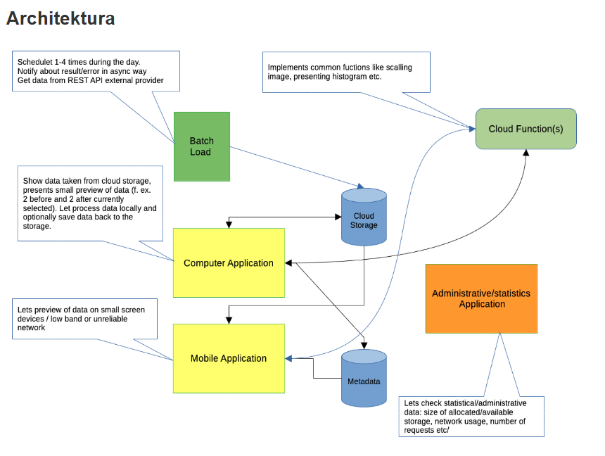

# Image App

Welcome to the **Image App**! This guide will help you set up the project, configure Firebase, and update the necessary environment variables to run the app successfully.

---

## Table of Contents

1. [Introduction](#introduction)
2. [Project Diagram](#project-diagram)
3. [Prerequisites](#prerequisites)
4. [Setting up Firebase](#setting-up-firebase)
5. [Updating the .env File](#updating-the-env-file)
6. [Running the App](#running-the-app)
7. [Feature Control via Environment Variables](#feature-control-via-environment-variables)

---

## Introduction

This Flutter application, **Image App**, allows users to save, edit, and view images. It can run on both Android devices and the web. The app leverages Firebase services such as Authentication, Firestore, Storage, Remote Config, and Cloud Functions. To get started, you need to configure a Firebase project and update the environment variables for seamless integration.

---

## Project Diagram

Below is the architecture diagram illustrating the high-level design of the project:



### Key Components:
- **Batch Load**: Schedules tasks, retrieves data from external REST APIs, and sends data to Cloud Storage.
- **Cloud Functions**: Implements common functions like image scaling and presenting histograms.
- **Cloud Storage**: Stores data for applications and metadata for administrative purposes.
- **Computer Application**: Displays data, allows local processing, and optionally saves updates to storage.
- **Mobile Application**: Provides a lightweight preview for small screen devices and low-bandwidth networks.
- **Administrative/Statistics Application**: Enables the review of statistical data like storage usage, network usage, and request numbers.

---

## Prerequisites

Make sure you have the following installed:

- [Flutter SDK](https://docs.flutter.dev/get-started/install)
- [Firebase CLI](https://firebase.google.com/docs/cli)
- Node.js (for Firebase CLI)
- A Google account for Firebase Console access

---

## Setting up Firebase

1. **Create a Firebase Project:**
   - Go to the [Firebase Console](https://console.firebase.google.com/).
   - Click on **Add Project**.
   - Follow the steps to create a new project.

2. **Add an App to Firebase:**
   - In your Firebase project, click on **Add App**.
   - Choose **Android** or **iOS** based on your Flutter project setup.
   - Register your app by providing the package name (e.g., `com.example.imageapp`).

3. **Download the Configuration Files:**
   - For Android: Download the `google-services.json` file and place it in the `android/app` directory.
   - For iOS: Download the `GoogleService-Info.plist` file and place it in the `ios/Runner` directory.

4. **Enable Firebase Services:**
   - Go to the Firebase Console and enable the following services:
     - **Authentication**: For user sign-in and management.
     - **Firestore**: For real-time database and data synchronization.
     - **Storage**: For storing files and assets.
     - **Remote Config**: For dynamic configuration of the app.
     - **Functions**: For serverless backend logic.

5. **Get the Storage Bucket URL:**
   - Navigate to **Build > Storage** in the Firebase Console.
   - Copy the storage bucket URL (e.g., `your-project-id.appspot.com`).

---

## Updating the .env File

1. **Locate the .env File:**
   - Open the project root directory and find the `.env` file.

2. **Update the Required Variables:**
   - Add or update the following lines in your `.env` file:
     ```env
     FEATURE_ADD_IMAGE=true
     FEATURE_ADD_FOLDER=true
     FEATURE_CHECK_ANALYTICS=true
     EMULATOR_MODE=true
     ```
    
   - Add or update the following lines in your `/functions/.env` file:
     ```env
     STORAGE_BUCKET=your-project-id.appspot.com
     ```

   - Explanation of Variables:
     - `FEATURE_ADD_IMAGE`: Enables the feature to add images.
     - `FEATURE_ADD_FOLDER`: Enables the feature to add folders.
     - `FEATURE_CHECK_ANALYTICS`: Enables the analytics page (only visible to users with the `Admin` role).
     - `EMULATOR_MODE`: Runs the project using Firebase emulators instead of the real Firestore.

3. **Save Changes:**
   - Save the file and ensure it's properly formatted.

---

## Running the App

1. **Install Dependencies:**
   - Run the following command to fetch all necessary dependencies:
     ```bash
     flutter pub get
     ```

2. **Run the App:**
   - Start the app using:
     ```bash
     flutter run
     ```

3. **Verify Firebase Integration:**
   - Test Firebase-dependent features such as authentication, Firestore, or storage to ensure proper setup.

---

## Feature Control via Environment Variables

The app includes feature flags controlled through the `.env` file:

- **Feature Flags:**
  - `FEATURE_ADD_IMAGE`: Enables the ability to add images.
  - `FEATURE_ADD_FOLDER`: Enables the ability to add folders.
  - `FEATURE_CHECK_ANALYTICS`: Allows access to the analytics page.

- **Emulator Mode:**
  - Setting `EMULATOR_MODE=true` enables the app to run using Firebase emulators instead of real Firestore and other Firebase services.

- **Analytics Page Access:**
  - Only users with the role set as `Admin` can view the analytics page.

---

## Troubleshooting

- **Missing Firebase Configuration:** Ensure the `google-services.json` or `GoogleService-Info.plist` file is correctly placed in your project.
- **Incorrect STORAGE_BUCKET Value:** Double-check the storage bucket URL in the `.env` file.
- **Dependencies Not Installed:** Run `flutter pub get` to resolve missing packages.

---

## Additional Resources

- [Firebase Documentation](https://firebase.google.com/docs)
- [FlutterFire Documentation](https://firebase.flutter.dev/)
- [Flutter Official Documentation](https://docs.flutter.dev)

---

